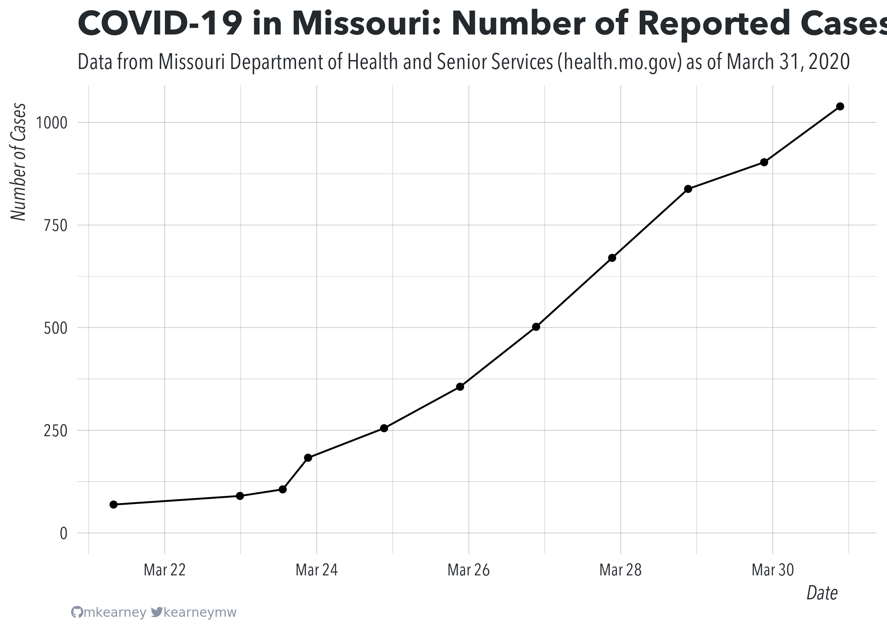

<!-- README.md is generated from README.Rmd. Please edit that file -->

# covid-19-missouri

<!-- badges: start -->

<!-- badges: end -->

This repo is for collecting testing and case-tracking information about
COVID-19 in the great state of Missouri. Currently, [this
code](R/scrape.R) is used to scrape updates from
[health.mo.gov](https://health.mo.gov).

## Data

Data are saved as CSV files with each row representing a new observation
at the state or county level:

  - [State-wide totals](data/mo-total.csv)
  - [Cases by county](data/mo-county.csv)

<!-- end list -->

``` r
## state totals daya
suppressMessages(readr::read_csv("data/mo-total.csv"))
#> # A tibble: 11 x 49
#>    state state_abb total_cases state_labs other_labs ages_Boone ages_Camden
#>    <chr> <chr>           <dbl>      <dbl>      <dbl>      <dbl>       <dbl>
#>  1 Miss… MO               1039        124        915          1           1
#>  2 Miss… MO                903         92        811          1           1
#>  3 Miss… MO                838         98        740          1           1
#>  4 Miss… MO                670         90        580          1          NA
#>  5 Miss… MO                502         72        430          1          NA
#>  6 Miss… MO                356         62        294          1          NA
#>  7 Miss… MO                255         55        200         NA          NA
#>  8 Miss… MO                183         47        136         NA          NA
#>  9 Miss… MO                106         47         59         NA          NA
#> 10 Miss… MO                 90         38         52         NA          NA
#> 11 Miss… MO                 69         NA         NA         NA          NA
#> # … with 42 more variables: ages_Greene <dbl>, ages_Henry <dbl>,
#> #   ages_Jackson <dbl>, ages_Lafayette <dbl>, `ages_St. Charles County` <dbl>,
#> #   `ages_St. Louis City` <dbl>, `ages_St. Louis County` <dbl>,
#> #   transmission_under_20 <dbl>, transmission_x20_24 <dbl>,
#> #   transmission_x25_29 <dbl>, transmission_x30_34 <dbl>,
#> #   transmission_x35_39 <dbl>, transmission_x40_44 <dbl>,
#> #   transmission_x45_49 <dbl>, transmission_x50_54 <dbl>,
#> #   transmission_x55_59 <dbl>, transmission_x60_64 <dbl>,
#> #   transmission_x65_69 <dbl>, transmission_x70_74 <dbl>,
#> #   transmission_x75_79 <dbl>, transmission_x80 <dbl>,
#> #   transmission_unknown <dbl>, .timestamp <dttm>, .last_updated <dttm>,
#> #   `ages_St. Charles` <dbl>, transmission_x20_29 <dbl>,
#> #   transmission_x30_39 <dbl>, transmission_x40_49 <dbl>,
#> #   transmission_x50_59 <dbl>, transmission_x60_69 <dbl>,
#> #   transmission_x70 <dbl>, ages_0_20 <dbl>, ages_20_29 <dbl>,
#> #   ages_30_39 <dbl>, ages_40_49 <dbl>, ages_50_59 <dbl>, ages_60_69 <dbl>,
#> #   ages_70_plus <dbl>, transmission_travel <dbl>, transmission_contact <dbl>,
#> #   transmission_no_known_contact <dbl>, transmission_no_contact <dbl>

## county data
suppressMessages(readr::read_csv("data/mo-county.csv"))
#> # A tibble: 2,599 x 6
#>    county    total state_lab other_lab  fips timestamp          
#>    <chr>     <dbl>     <dbl>     <dbl> <dbl> <dttm>             
#>  1 Adair         1         0         1 29001 2020-03-31 13:16:01
#>  2 Andrew        0         0         0 29003 2020-03-31 13:16:01
#>  3 Atchison      1         1         0 29005 2020-03-31 13:16:01
#>  4 Audrain       0         0         0 29007 2020-03-31 13:16:01
#>  5 Barry         1         0         1 29009 2020-03-31 13:16:01
#>  6 Barton        0         0         0 29011 2020-03-31 13:16:01
#>  7 Bates         1         0         1 29013 2020-03-31 13:16:01
#>  8 Benton        1         0         1 29015 2020-03-31 13:16:01
#>  9 Bollinger     1         0         1 29017 2020-03-31 13:16:01
#> 10 Boone        59         4        55 29019 2020-03-31 13:16:01
#> # … with 2,589 more rows
```


