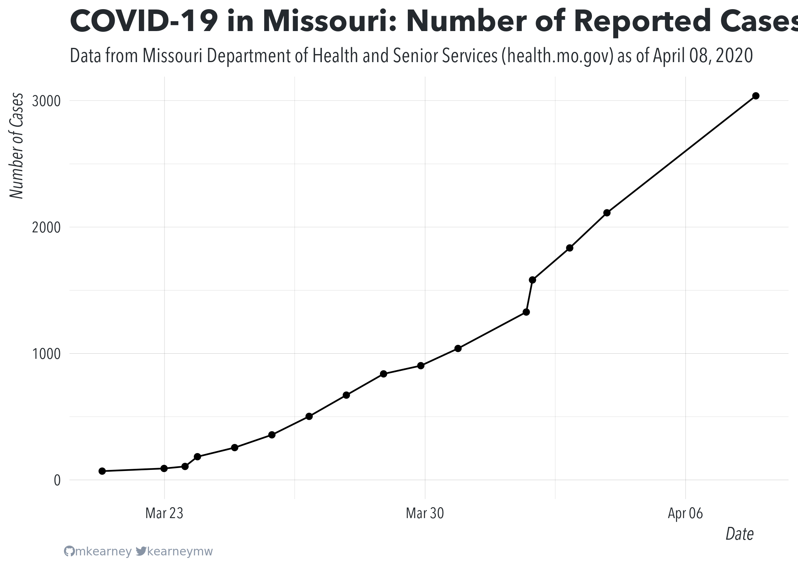

<!-- README.md is generated from README.Rmd. Please edit that file -->

# covid-19-missouri

<!-- badges: start -->

<!-- badges: end -->

This repo is for collecting testing and case-tracking information about
COVID-19 in the great state of Missouri. Currently, [this
code](R/scrape.R) is used to scrape updates from
[health.mo.gov](https://health.mo.gov).

## Data

Data are saved as CSV files with each row representing a new observation
at the state or county level:

  - [State-wide totals](data/mo-total.csv)
  - [Cases by county](data/mo-county.csv)

<!-- end list -->

``` r
## state totals daya
suppressMessages(readr::read_csv("data/mo-total.csv"))
#> # A tibble: 7 x 32
#>   state state_abb total_cases state_labs other_labs ages_Boone ages_Greene
#>   <chr> <chr>           <dbl>      <dbl>      <dbl>      <dbl>       <dbl>
#> 1 Miss… MO                502         72        430          1           3
#> 2 Miss… MO                356         62        294          1           3
#> 3 Miss… MO                255         55        200         NA          NA
#> 4 Miss… MO                183         47        136         NA          NA
#> 5 Miss… MO                106         47         59         NA          NA
#> 6 Miss… MO                 90         38         52         NA          NA
#> 7 Miss… MO                 69         NA         NA         NA          NA
#> # … with 25 more variables: ages_Jackson <dbl>, `ages_St. Charles` <dbl>,
#> #   `ages_St. Louis City` <dbl>, `ages_St. Louis County` <dbl>,
#> #   transmission_under_20 <dbl>, transmission_x20_29 <dbl>,
#> #   transmission_x30_39 <dbl>, transmission_x40_49 <dbl>,
#> #   transmission_x50_59 <dbl>, transmission_x60_69 <dbl>,
#> #   transmission_x70 <dbl>, .timestamp <dttm>, .last_updated <dttm>,
#> #   ages_0_20 <dbl>, ages_20_29 <dbl>, ages_30_39 <dbl>, ages_40_49 <dbl>,
#> #   ages_50_59 <dbl>, ages_60_69 <dbl>, ages_70_plus <dbl>,
#> #   transmission_travel <dbl>, transmission_contact <dbl>,
#> #   transmission_no_known_contact <dbl>, transmission_unknown <dbl>,
#> #   transmission_no_contact <dbl>

## county data
suppressMessages(readr::read_csv("data/mo-county.csv"))
#> # A tibble: 742 x 6
#>    county         total state_lab other_lab  fips timestamp          
#>    <chr>          <dbl>     <dbl>     <dbl> <dbl> <dttm>             
#>  1 Adair              1         0         1 29001 2020-03-27 01:16:01
#>  2 Bates              1         0         1 29013 2020-03-27 01:16:01
#>  3 Benton             1         0         1 29015 2020-03-27 01:16:01
#>  4 Bollinger          1         0         1 29017 2020-03-27 01:16:01
#>  5 Boone             25         1        24 29019 2020-03-27 01:16:01
#>  6 Callaway           2         0         2 29027 2020-03-27 01:16:01
#>  7 Camden             1         1         0 29029 2020-03-27 01:16:01
#>  8 Cape Girardeau     3         0         3 29031 2020-03-27 01:16:01
#>  9 Carter             1         1         0 29035 2020-03-27 01:16:01
#> 10 Cass               8         2         6 29037 2020-03-27 01:16:01
#> # … with 732 more rows
```


